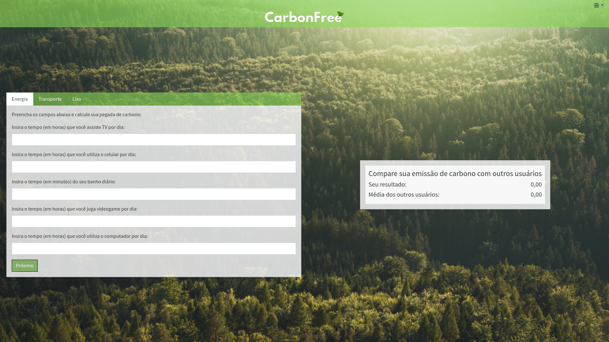
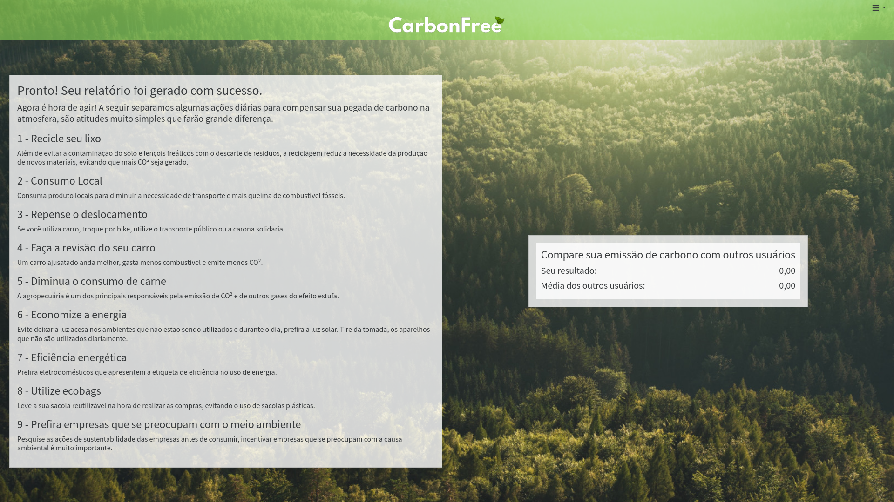

# Registro de Testes de Software

<table>
    <thead>
        <tr> 
            <th>Caso do Teste</th>
            <th>CT-01 - Exibir questionário inicial</th>
        </tr>
    </thead>
       <tbody>
        <tr> 
            <td>Requisitos Associados</td>
            <td>
                RF-01 - O site deve apresentar um questionário sobre o estilo de vida do usuário, incluindo perguntas sobre hábitos de alimentação, transporte, consumo energético, renda, entre outros.
                RF-04 - O site deve permitir que o usuário refaça o questionário sobre estilo de vida sempre que achar necessário.
            </td>
        </tr>
        <tr> 
            <td>Objetivos do Teste</td>
            <td>
                Verificar se o questionário é apresentado e recebe informações necessárias para cálculo.
            </td>
        </tr>
        <tr> 
            <td>Passos</td>
            <td>
                1. Acessar o navegador 
                2. Informar o endereço do site 
                3. Criar uma conta 

 4. Realizar o login 

 5. A tela principal conterá as perguntas do questionário. 

</td>
</tr>
<tr>
<td>Critérios de Êxito</td>
<td>
As perguntas do questionário devem ser exibidas no site, após clicar na opção. 
Os campos específicos devem estar habilitados para receber as respostas dos usuários.
</td>
</tr>
<tr>
<td>Resultado do teste</td>
<td>
O teste foi concluído com sucesso.
</td>
</tr>
</tbody>
</table>

<table>
    <thead>
        <tr> 
            <th>Caso do Teste</th>
            <th>CT-02 - Exibir checklist de ações diárias recomendadas</th>
        </tr>
    </thead>
       <tbody>
        <tr> 
            <td>Requisitos Associados</td>
            <td>
                RF-02 - O site deve apresentar na página inicial uma checklist
                personalizada de ações diárias para redução da pegada de
                carbono do usuário, baseada no questionário inicial.
            </td>
        </tr>
        <tr> 
            <td>Objetivos do Teste</td>
            <td>
                Verificar se estão sendo sugeridas atividades para redução da emissão de carbono do usúario.
            </td>
        </tr>
        <tr> 
            <td>Passos</td>
            <td>
                1. Acessar o navegador 
                2. Informar o endereço do site 
                3. Fazer login 

 4. Selecionar a opção atividades sugeridas

</td>
</tr>
<tr>
<td>Critérios de Êxito</td>
<td>
Após realizar o login, o usuário deve acessar a opção atividades sugeridas e visualizá-las.
</td>
</tr>
<tr>
<td>Resultado do teste</td>
<td>
Teste realizado com sucesso.
</td>
</tr>
</tbody>

</table>

Os demais testes ainda não foram realizados, pois ainda não foram desenvolvidas todas as funcionalidades para o site.

Pré-requisitos: <a href="3-Projeto de Interface.md"> Projeto de Interface</a>, <a href="8-Plano de Testes de Software.md"> Plano de Testes de Software</a>

Relatório com as evidências dos testes de software realizados no sistema pela equipe, baseado em um plano de testes pré-definido.

## Avaliação

Discorra sobre os resultados do teste. Ressaltando pontos fortes e fracos identificados na solução. Comente como o grupo pretende atacar esses pontos nas próximas iterações. Apresente as falhas detectadas e as melhorias geradas a partir dos resultados obtidos nos testes.

> **Links Úteis**:
>
> - [Ferramentas de Test para Java Script](https://geekflare.com/javascript-unit-testing/)
