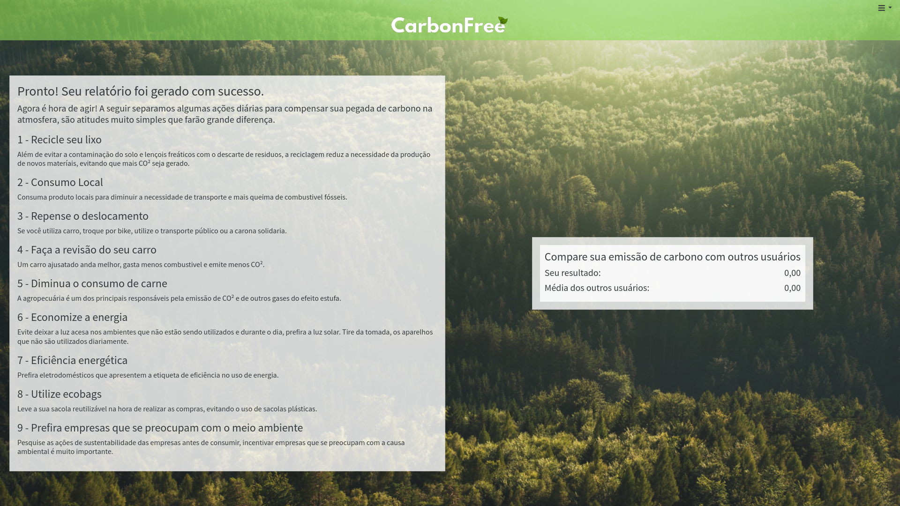

# Registro de Testes de Usabilidade

## CTU-02 Testar a responsividade do site

Conforme prints abaixo, feitos tanto pelo computador quanto pelo smartphone, o site é responsivo.
É possível navegar adequadamente em ambos os dispositivos, tendo acesso a todas funcionalidades.

### Telas desktop

Cadastro

Login

Perguntas

Atividades sugeridas

### Telas mobile

Cadastro

Login

Perguntas

Atividades sugeridas

## CT-04 Avaliar a velocidade geral do site

Conforme relatórios do Lighthouse, disponível no DevTools do Google Chrome, todas as páginas tiveram um tempo de carregamento inferior a um segundo.

Cadastro

Login

Perguntas

Atividades sugeridas

Após realizar os testes de usabilidade, obtém-se um relatório a partir das análises realizadas. O Registro de Testes de Usabilidade é um relatório que contém as evidências dos testes e relatos dos usuários participantes, baseado no Plano de Testes de Usabilidade desenvolvido para os casos de uso desta etapa.

As referências abaixo irão auxiliá-lo na geração do artefato “Registro de Testes de Usabilidade”.

> **Links Úteis**:
>
> - [Ferramentas de Testes de Usabilidade](https://www.usability.gov/how-to-and-tools/resources/templates.html)
